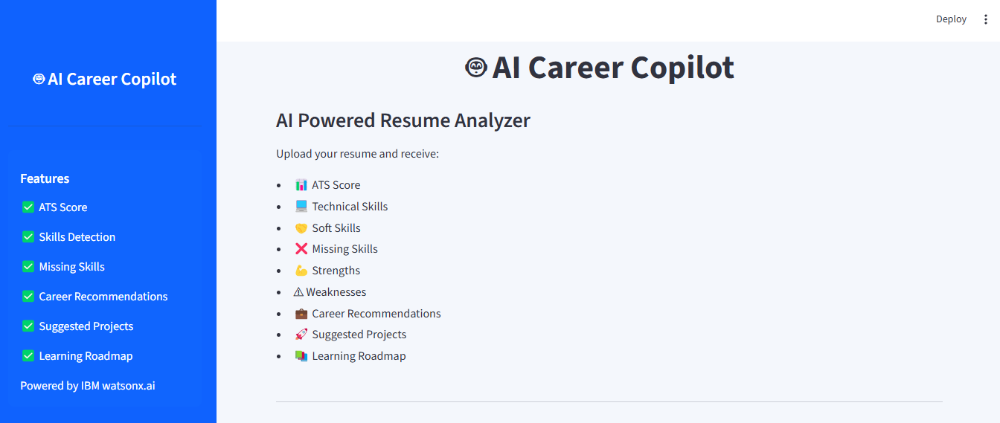
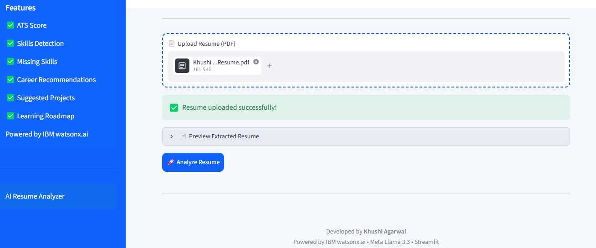
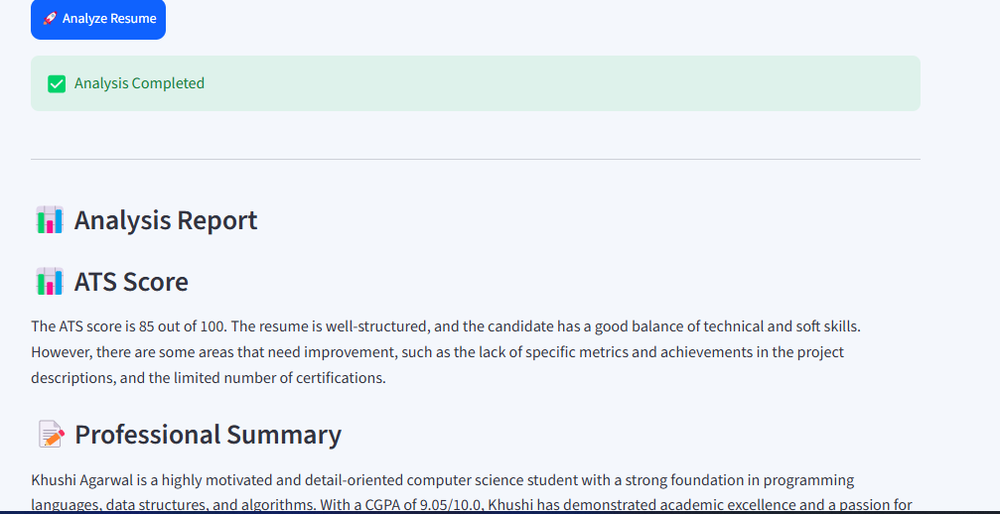
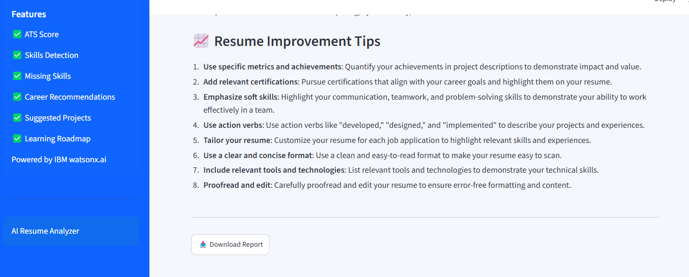

# 🤖 AI Career Copilot

An AI-powered Resume Analyzer built using **Python**, **Streamlit**, and **IBM watsonx.ai**. The application analyzes uploaded resumes, provides an ATS score, identifies skills and skill gaps, recommends suitable career paths, suggests portfolio projects, and creates a personalized learning roadmap.

---

## 📌 Features

* 📄 Upload Resume (PDF)
* 📊 ATS Score Analysis
* 📝 Professional Resume Summary
* 💻 Technical Skills Detection
* 🤝 Soft Skills Identification
* ❌ Missing Skills Analysis
* 💪 Strengths & Weaknesses Evaluation
* 💼 Best Job Role Recommendations
* 🚀 Suggested Portfolio Projects
* 📚 Personalized Learning Roadmap
* 📈 Resume Improvement Tips
* 📥 Download Analysis Report
* ☁️ Powered by IBM watsonx.ai

---

## 🛠️ Tech Stack

* Python
* Streamlit
* IBM watsonx.ai
* Meta Llama 3.3 Instruct
* PyPDF2
* python-dotenv

---

## 📂 Project Structure

```text
AI-Career-Copilot/
│
├── app.py                 # Streamlit application
├── ai_analyzer.py         # IBM watsonx.ai integration
├── resume_parser.py       # PDF text extraction
├── style.css              # Custom UI styling
├── requirements.txt       # Project dependencies
├── .env                   # IBM credentials (not uploaded)
├── .gitignore
└── README.md
```

---

## ⚙️ Installation

### 1. Clone the Repository

```bash
git clone https://github.com/YOUR_GITHUB_USERNAME/AI-Career-Copilot.git
cd AI-Career-Copilot
```

Replace `YOUR_GITHUB_USERNAME` with your GitHub username.

---

### 2. Create a Virtual Environment

**Windows**

```bash
python -m venv myenv
myenv\Scripts\activate
```

**Linux/macOS**

```bash
python3 -m venv myenv
source myenv/bin/activate
```

---

### 3. Install Dependencies

```bash
pip install -r requirements.txt
```

---

### 4. Create a `.env` File

```env
IBM_API_KEY=YOUR_API_KEY
IBM_PROJECT_ID=YOUR_PROJECT_ID
IBM_URL=https://eu-de.ml.cloud.ibm.com
```

---

### 5. Run the Application

```bash
streamlit run app.py
```

Open your browser and visit:

```
http://localhost:8501
```

---

## 📊 Sample Analysis

The application generates a detailed report including:

* ATS Score
* Professional Summary
* Technical Skills
* Soft Skills
* Missing Skills
* Strengths
* Weaknesses
* Best Job Roles
* Suggested Projects
* Learning Roadmap
* Resume Improvement Tips

---

## 📸 Screenshots

### 🏠 Home Page



### 📄 Upload Resume



### 📊 Resume Analysis



### 📥 Download Report



---

## 🚀 Future Improvements

* 🎯 Job Description Match Analyzer
* 🎤 AI Interview Question Generator
* 📄 PDF Report Generation
* 📊 Interactive Dashboard
* 🌙 Dark Mode Support
* 📚 Learning Resource Recommendations

---

## 👩‍💻 Author

**Khushi Agarwal**

B.Tech Computer Science Engineering

GitHub: https://github.com/KhushiAgarwal10

---

## 📜 License

This project is developed for educational, portfolio, and learning purposes.

